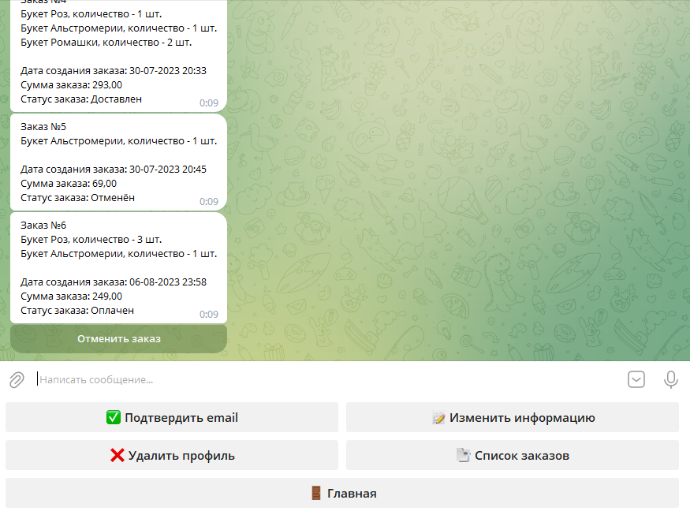

# [flower-shop-telegram-bot](https://t.me/my_flower_shop_bot)
Телеграм-бот магазин цветов с веб-интерфейсом. Проект состоит из нескольких сервисов:

telegram-bot - сервис с основной логикой для работы магазина. Регистрация, подтверждение почты,
добавление товаров, тестовая оплата и отмена заказа

mail-service - сервис для отправки писем с кодом для подтверждения почты

admin-panel - веб-интерфейс для добавления/редактирования товаров и доставки заказов

common-jpa, common-utils - общие библиотеки

***
## Technology stack
Java 17, Maven, Spring (Boot, MVC, Data, Security),
Hibernate, Postgresql, Liquibase, RabbitMq, Log4j, Docker Compose

***

## Screenshots
#### Telegram bot

#### Admin panel

